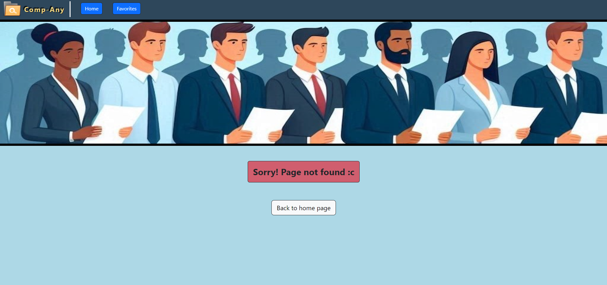

# Comp-Any ReactJS project

## Overview

Project created by <b>_Einav Kohavi_</b>

Welcome to Comp-Any! 
In here I will describe the goals and funcionalities of the project. 
The project was created for my ReactJS course in software engineering studies.

My project is using ReactJS, Bootstrap, Routing, Icons, Leaflet and more. 
The project's goal is to allow visitors to search an API for employees in different companies around the world. 
<b>Note the API's employees and companies are not real. This project is for studying purposes only.</b>

The project's website is also uploaded on a Netlify domain for quick access in: 
[https://comp-any.netlify.app/](https://comp-any.netlify.app/)

---

#### Environments, libraries and technologies used:

> The application is using:
>
> - `Visual Studio Code` IDE envirnment for writing the code
>
> - `React router dom` library for navigation and routing
>
> - `Employees API` for fetching and showing objects accordingly
>
> - `Leaflet` library for map containers showing employee's locations
>
> - `Toastify` notification for user friendly website messages
>
> - `React Icons` library for favorite employee icons
>
> - `Bootstrap` and `CSS` for the applications designs

#### Notes:

- Thanks to Netlify, you can access, review and test the website directly in `https://comp-any.netlify.app/`. 
  There is no need to download the code, install all libraries and run the code yourself. 
  Note that sometimes when refreshing pages in Netlify, a `Page not found` messages appears. 
  When this happens, go back to the Comp-Any's home page.
  This only happens in Comp-Any's Netlify domain.

- The website is made compatible for all web browsers and responsive to mobile devices as well.

- Most pages and components in the application are using the `Context.js` file. 
  This file keeps all important global variables and some global functions to use around the website.

---

## Pages

> The website includes four pages:
>
> - `Home page` - Main page of the website
>
> - `Employee details page` - Details page for selected employee
>
> - `Favorite employees page` - Page that shows the list of favorited employees
>
> - `Error 404 page` - Path not found page

---

### Header component

Every page in the website shows the header at the top. 

#### Contents:

> The header contains:
>
> - The website's logo and name.
>
> - Two accessible navigation buttons for home and favorites pages.
>
> - Custom strip image.

#### Functionality:

The header component allows the user to navigate between the website's pages.

#### Image:

---

### Home page

The main page for the website. 

#### Contents:

> The home page contains:
>
> - Welcome text.
>
> - Search input and button for searching companies.
>
> - An employee list component for showing selected company's employees (At first run, the list is set to show a default list).
>
> - Each employee is shown using the `EmployeeCard.js` component, showing basic information and a small picture. 
>   Each card also contains a `More Information` button and a `Favorite` button.

#### Functionality:

The home page allows the user to search for companies and show it's employees in a large list. 
In this page, a component called `SearchResults` is used to show the employees. 
The component includes the input, button and list. It is responsible for fetching required employees from the API and showing them using employee cards.

#### Image:

---

### Employee details page

The page that the user is being redirected to when clicking the `More Information` button of an employee card.

#### Contents:

> The employee details page contains:
>
> - "Details for `employee name`" header
>
> - Employee's profile image in larger scale
>
> - Different extended information about the employee (Full name, contact information, location details etc).
>
> - A map showing the employee's location provided from the employee's JSON object from the API (Uses `Leaflet`).
>
> - A button to go back to the previously visited page and another to go back to the home page.

#### Functionality:

This page shows extended details about the selected employee. 
It also allows the user to favorite the shown employee. 
The user can click the `Back` button to return to the previously visited page, or the `Back to home page` to return to the home page.

#### Image:

---

### Favorites page

This page shows the user's favorited employees in `Employee card` form.

#### Contents:

> The favorites page contains:
>
> - "Favorites" header
>
> - List of the user's favorited employees in `Employee card` form

#### Functionality:

This page uses an array and a local storage entry of favorited employees to show them to the user. 
`Employee cards` in this page have the same functionalities as in the home page.

#### Image:

---

### Error 404 page

This page pops up if the path given in the url is not found within the list of routes available in the website.

#### Contents:

> The error 404 page contains:
>
> - Page not found message
>
> - A button to go back to home page

#### Functionality:

This page lets the user know the page given in the url was not found and allows to go back to the home page by clicking the `Back to home page` button.

#### Image:

---

## Toastify

When favoriting or unfavoriting an employee, `Toasify` messages appear. 
Below is an image presentation.

---

# Thank you for viewing my project and giving feedback! c:

---
